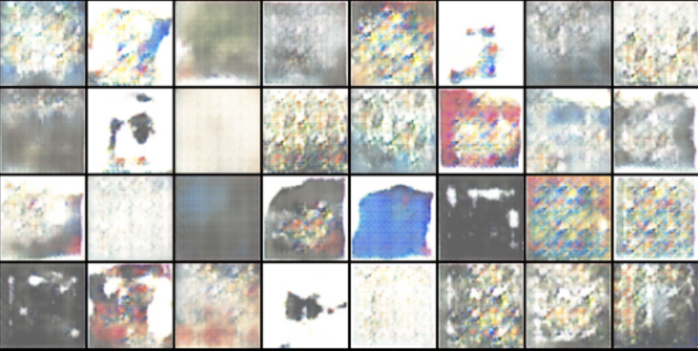

# Art-GAN

The dataset consist of abstract art taken from [kaggle](https://www.kaggle.com/datasets/bryanb/abstract-art-gallery) and trained using a [Generative Adversarial Net](https://arxiv.org/abs/1406.2661). Training took about 11.5 hours and generated the following:

## Future improvements
- fix issue with low image saturation
- possibly add breakpoint for when loss reaches a certain value
- improve models